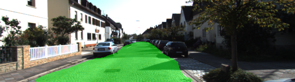
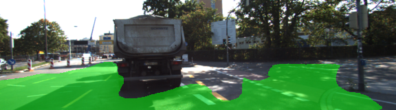

# SS_Cman
## Submission for Term3 Project 2: Semantic Segmentation
**Objective**: Implement a Fully Convolutional Network (FCN) in TensorFlow to **segment road pixel** in images. 

**Approch**: Adapted a pre-trained FCN to a simplified version of the [FCN8](https://people.eecs.berkeley.edu/~jonlong/long_shelhamer_fcn.pdf). Added **1x1 convolutions** to the **pretrained VGG16** feature encoder reducing into a 2-pixel classifier (road/no-road). Also added 2 **transposed convolutions** scaling up the image to its original size, shape = (160, 576). Connected 2 **skip layers** from layer 3 and 4 to improve resolution. 

After the training process all test images are processed to highlight the detected road pixels in green color overlay. Please see complete [results](./runs/1528540282.322428_BS5_DP0.50_LR0.0001_EP50) of the fully trained and adapted FCN. The project solution must satisfy the [rubric](https://review.udacity.com/#!/rubrics/989/view) conditions.

### Graph Diagram


### Training and Hyperparams
The network is trained on the [KITTI Raod dataset](http://www.cvlibs.net/datasets/kitti/eval_road.php) (289 images) for 15 epochs with batch size of 5. Other batch sizes showed significant differences in accuracy and 5 seems a good balance between preventing early over-fitting, exhaustive memory usage and high accuracy.

##### Accuracy and total loss running BATCH_SIZE=(5, 10, 15), LEARNING_RATE=0.0001 and EPOCHS=15:


##### Accuracy and total loss running BATCH_SIZE=5, LEARNING_RATE=(0.0001, 0.0005, 0.001) and EPOCHS=15:


##### Accuracy and total loss running BATCH_SIZE=5, LEARNING_RATE=0.0001 and EPOCHS=50:


### Project Result Samples:

##### Good road pixel detection:





##### Poor road pixel detection:





### Environment Setup
To run the project several technical preconditions need to be established. 

`main.py` will check to make sure you are using GPU - if you don't have a GPU on your system, you can use AWS or another cloud computing platform.

If you run a GPU **double-check compatibility** of package versions, eg. tensorflow 1, cuda 9, cudnn 7 !

##### Frameworks and Packages
Make sure you have the following is installed:
 - [Python 3](https://www.python.org/)
 - [TensorFlow](https://www.tensorflow.org/)
 - [NumPy](http://www.numpy.org/)
 - [SciPy](https://www.scipy.org/)

##### How to run the project
```
git clone https://github.com/tochalid/SS_Cman.git
```
Download and extract the [dataset](http://www.cvlibs.net/download.php?file=data_road.zip)  in the `data` folder.  This will create the folder `data_road` with all the training and test images.

```
python main.py
``` 
To start the TensorBoard service run command:
```
tensorboard --logdir ./tb
``` 
Call [http://TB_HOSTNAME:6006](http://TB_HOSTNAME:6006) in your browser

##### Refs
- The link for the frozen `VGG16` model is hardcoded into `helper.py`. The model can be found [here](https://s3-us-west-1.amazonaws.com/udacity-selfdrivingcar/vgg.zip)
- The model is not vanilla `VGG16`, but a fully convolutional version, which already contains the 1x1 convolutions to replace the fully connected layers. Please see this [forum post](https://discussions.udacity.com/t/here-is-some-advice-and-clarifications-about-the-semantic-segmentation-project/403100/8?u=subodh.malgonde) for more information.
- The Udacity project repository is [here](https://github.com/udacity/CarND-Semantic-Segmentation)
- How to use TensorBoard see [here](https://www.tensorflow.org/programmers_guide/summaries_and_tensorboard)